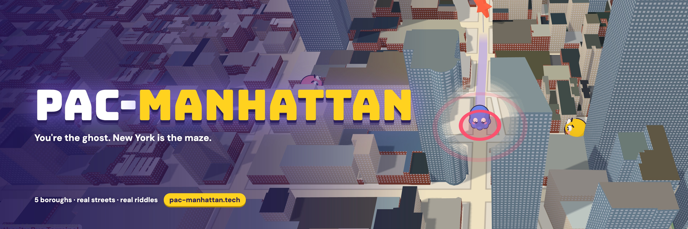
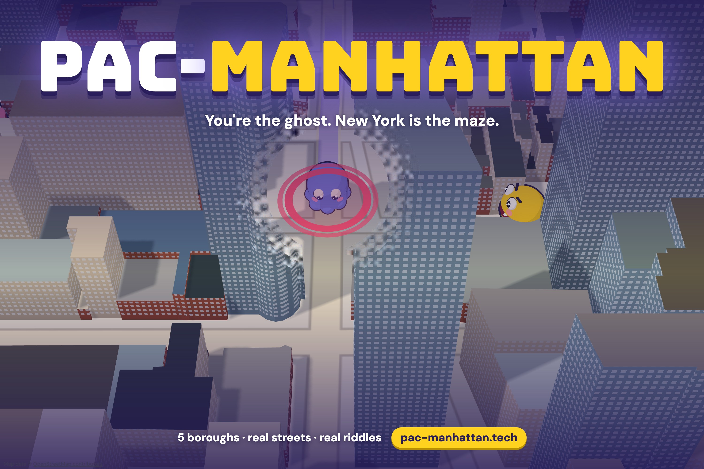
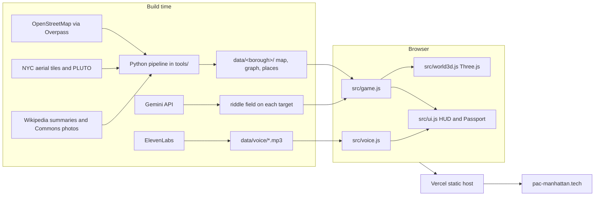
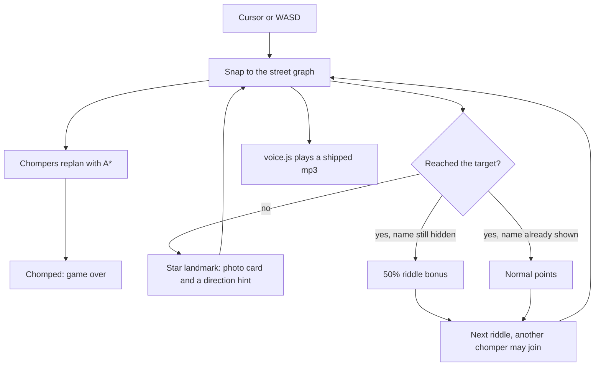

<p align="center">
  
</p>

<h1 align="center">Pac-Manhattan</h1>

<p align="center"><b>You're the ghost. New York is the maze.</b><br>
A 3D arcade chase through real NYC streets that teaches you the city one riddle at a time.</p>

<p align="center">
  <a href="https://pac-manhattan.tech"><b>Play it at pac-manhattan.tech</b></a>
  &nbsp;·&nbsp; Built at <b>DivHacks 2026</b> (Columbia University) &nbsp;·&nbsp; Track: <b>Know Your City</b>
</p>

---

## The problem

**New Yorkers live in borough bubbles.**

- **86%** of New Yorkers who moved stayed in the same borough ([StreetEasy, via amNY](https://www.amny.com/news/most-new-yorkers-who-move-stay-in-their-boroughs-report-finds-1.12449875/)).
- **1 in 4** Americans have never been to the biggest attraction in their own city, and **55%** want to visit a local landmark but haven't ([OnePoll for Zipcar, 2,000 adults](https://www.foxnews.com/travel/25-percent-of-americans-havent-visited-iconic-landmarks-in-their-own-cities-study-finds)).
- We've handed our sense of direction to our phones: more lifetime GPS use goes with worse spatial memory when you navigate on your own ([Dahmani & Bohbot, *Scientific Reports*, 2020](https://www.nature.com/articles/s41598-020-62877-0)), and people navigate best in street layouts like the ones they actually grew up in ([Coutrot et al., *Nature*, 2022](https://www.nature.com/articles/s41586-022-04486-7)).

Meanwhile New York drew **65 million visitors in 2025** ([NYC Tourism + Conventions](https://www.business.nyctourism.com/press-media/press-releases/NYC-Tourism-Annual-Report-March-2026)), and most of them, like most of us, see the same few blocks.

**Games can move people.** Pokémon Go's most engaged players walked 1,473 more steps a day, a jump of over 25% ([Althoff et al., *JMIR*, 2016](https://www.jmir.org/2016/12/e315/)). So we made the game board the real map of New York.

## What it is

Pac-Manhattan flips Pac-Man. **You're the ghost**, and hungry chompers hunt you through real New York streets.

**Solve a riddle → find the place → visit landmarks for hints → don't get chomped**

- **Riddles about real places.** "Visit the former factory where the famous dark sandwich cookie was invented." Find it before the name is revealed for a 50% bonus.
- **Themed runs.** Type a theme like "food spots" or "a first date" and Gemini picks that run's places, only from the places in the game.
- **Landmarks** give you a photo, a fun fact, a Wikipedia summary, and a hint with the target's walking distance and direction. Every place you reach is stamped in your **Passport**.
- **Know the block.** Every place card shows the streets around it, live from a 767,563-building NYC database: "151 buildings within a block or two, typically built around 1879; the oldest dates to 1819."
- **Riddle stats.** After you solve one, see how everyone else did: "12 of 17 finds solved this riddle before the name appeared, in 41 s on average."
- **Three chompers with personalities.** Chomps chases you, Sneaky cuts you off, Snooze pounces when you get close. A new one joins after every task.
- **Seven maps.** All of Manhattan; Brooklyn, Queens, the Bronx and Staten Island; Manhattan + Brooklyn; and **all five boroughs on one map**, joined by the Brooklyn, Manhattan, Williamsburg, Queensboro, Macombs Dam and Third Avenue Bridges and the **Staten Island Ferry**. Chompers can't swim, so they wait at the terminal.
- **A real city in real colors.** 171,710 buildings at their real heights. Roofs are colored from NYC's 2018 aerial photos and walls from each lot's year built and building class, so Brooklyn is brownstone and brick and Midtown is glass and limestone.
- **What you just learned.** Eight places add a short lesson to their card, written with Grok, three of them with a picture generated in Cursor.
- **A postcard from your run.** When you get caught, Gemini writes a short, funny recap from what actually happened in your run, and the narrator reads it aloud.
- **A narrator** who warns you when a chomper is behind you and calls out every bridge you cross.
- **2-player split screen**, racing to the same places on one keyboard.

<p align="center">
  
</p>

## How it works

| Piece | What we used it for |
|---|---|
| **Three.js** | The 3D city, characters and camera. Plain HTML and JavaScript, no build step. Buildings are built in chunks near the camera, and a see-through shader keeps the ghost visible behind skyscrapers. |
| **OpenStreetMap** | Streets, parks, water, buildings and shorelines for every borough, turned into a routable street graph (chompers use A* pathfinding). |
| **NYC Open Data** | 2018 aerial photos for roof colors, PLUTO lot data for wall materials, and 2020 neighborhood boundaries for Brooklyn and Queens (which sit on Long Island). |
| **Tiger Data** (TimescaleDB) | "Know the block" queries a 767,563-building table by location. Every riddle outcome goes into a **hypertable**, and a **real-time continuous aggregate** turns it into each place's solve rate and average time. |
| **MongoDB Atlas** | Global high scores, Passport stamps and finished runs, with a browser fallback when the database can't be reached. |
| **Gemini API** | Writes a riddle for every place from that place's own Wikipedia summary (a checker rejects any riddle that uses a word of the name or a number that isn't in the source); picks the places for themed runs, only from the game's own list; and writes the end-of-run postcard, rejected if it names a place or number that didn't happen in the run. |
| **Grok** (built in Cursor) | The "What you just learned" lessons and their pictures on eight place cards (`data/lessons.json`, prompt in `prompts/grok-lessons.md`). |
| **ElevenLabs** | The narrator: 16 lines recorded at build time, plus each end-of-run postcard read aloud through a server function. No API key ever reaches the browser. |
| **Vercel + .tech** | Static hosting plus serverless functions, at [pac-manhattan.tech](https://pac-manhattan.tech). |

## Architecture

Keys are used once, while building. The site that players open is a static folder: JSON maps, mp3 lines, and plain JavaScript. Nothing in the browser calls Gemini or ElevenLabs.



One frame of a run:



| Piece | Where | What it does |
|---|---|---|
| Street graph and A* | `src/graph.js` | Movement and chaser plans stay on real streets |
| Game loop, tasks, two-player | `src/game.js` | Riddle timer, scoring, ferry, bridges, chomper personalities |
| 3D city | `src/world3d.js` | Buildings, gold target beam, see-through shader |
| HUD | `src/ui.js` | Task card, Passport, minimap, place cards |
| Narrator | `src/voice.js` | Plays ElevenLabs mp3s in `data/voice/` |
| Riddle writer | `tools/make_riddles.py` | Gemini, then a name-leak and number check |
| Narrator recorder | `tools/make_voice.py` | ElevenLabs, once, into mp3 files |
| Scores and Passports | `src/cloud.js`, `api/` | MongoDB Atlas. Needs `MONGODB_URI`. |
| Know-the-block and riddle stats | `src/tiger.js`, `api/block.js`, `api/events.js` | Tiger Data. Needs `TIGER_DATABASE_URL`. |
| Map builder | `tools/build_borough.py`, `tools/build_bridges.py` | OSM, coastline, bridges, ferry, building colors |

## Sponsors

The game plays without the databases: scores fall back to the browser and the Tiger panel stays hidden when a connection string is missing. Neither string is in the repo. On the live site, `TIGER_DATABASE_URL` is set; `MONGODB_URI` is still to be added.

### In the build

**Know Your City (main track).** The board is the real city. Each task is a place you can walk to. The Passport is a stamp book of landmarks you reached. The five-borough map is the "know more than your own borough" pitch: bridges, the ferry, and places outside Midtown.

**Use of Gemini API.** `tools/make_riddles.py` calls `gemini-3.1-flash-lite` with `GEMINI_API_KEY`. For every target it sends that place's own fact and Wikipedia summary and asks for one sentence. A checker rejects the line if it contains a word from the place name, or a number that is not in the source, and retries up to three times. The kept line is stored as `riddle` on the place. The browser never sees the key. Places that fail the check show their name, same as before.

```sh
cd upload-1-code/pacman-3d
GEMINI_API_KEY=... python3 tools/make_riddles.py
python3 tools/build_bridges.py   # copy riddles onto the multi-borough maps
```

**Use of ElevenLabs.** This is the voice of the game. `tools/make_voice.py` calls Multilingual v2, voice Laura, with `ELEVENLABS_API_KEY`, and writes 16 mp3s into `data/voice/`: welcome, the riddle prompt, landmark, solved, found, a new chomper, "behind you", each bridge, the ferry, and game over. `src/voice.js` plays those files. There is no second narrator. The key is not in the site.

```sh
ELEVENLABS_API_KEY=... python3 tools/make_voice.py
```

**Postcard and themed runs (Gemini + ElevenLabs, live).** `api/recap.js` gets the facts of a finished run (map, places reached, target and how far away it still was, street, chomper, time, score). Gemini writes a two-sentence postcard; it's rejected and rewritten, up to three times, if it contains a number or a capitalized name that isn't in those facts, and a plain template is used if it never passes. ElevenLabs then reads it aloud. `api/theme.js` sends the map's places to Gemini with the player's theme and keeps only picks that are on that list. Both read `GEMINI_API_KEY` and `ELEVENLABS_API_KEY` on the server only.

**Use of MongoDB Atlas.** `api/scores.js`, `api/stamps.js`, and `api/runs.js` save high scores, landmark stamps, and each finished Passport. `src/cloud.js` sends them and keeps a copy in the browser, then retries if the save fails. The connection string is `MONGODB_URI` (optional database name `MONGODB_DB`, default `pacmanhattan`). It is read only on the server, in `api/_lib/db.js`. It is not set in this repo, so `/api/health` returns 503 until you add it in Vercel, or in `upload-1-code/pacman-3d/.env.local` for `npm run dev`. In Atlas, allow `0.0.0.0/0` so Vercel can connect.

**Use of Tiger Data.** Place cards can show a "know the block" panel: buildings within about 150 m, from a 767,563-building NYC table (`api/block.js`). Every riddle outcome is written to the `pm_events` hypertable (`api/events.js`), and `pm_riddle_hourly` is a real-time continuous aggregate of solve rate and time (`api/riddle.js`). The schema is `sql/tiger.sql`. The connection string is `TIGER_DATABASE_URL`, read only in `api/_lib/tiger.js`. It is set in the Vercel project, so the panel is live on pac-manhattan.tech. For your own copy, add it the same way as `MONGODB_URI`, then run `psql "$TIGER_DATABASE_URL" -f sql/tiger.sql`.

**SpaceXAI (Cursor + Grok).** Grok writes the on-screen lesson, not the voice. After you reach one of eight places, the card adds "What you just learned." Three cards also show a picture generated in Cursor (`data/lessons/`). The prompt is `upload-1-code/pacman-3d/prompts/grok-lessons.md`. The Wikimedia photo stays. ElevenLabs is still the only voice, including on the ferry and the Brooklyn Bridge, where the lesson is a toast under the ElevenLabs line.

## Run it locally

```sh
cd upload-1-code/pacman-3d
python3 -m http.server 8765
# open http://localhost:8765
```

That's the whole game. The live panels (Tiger Data) and global scores (MongoDB) need the serverless functions in `api/` and their database connection strings: run `npm install` and `npm run dev` with `TIGER_DATABASE_URL` and `MONGODB_URI` in `upload-1-code/pacman-3d/.env.local`. Without them the game plays the same and simply skips those parts.

The game's own [README](upload-1-code/pacman-3d/README.md) covers the controls, the code layout, tuning, and how to rebuild the map data, riddles and narrator.

## Repository

```
upload-1-code/pacman-3d/   the game (index.html, src/, data/, api/, tools/, sql/)
docs/devpost.md            our Devpost write-up
docs/media/                cover and banner images
```

## Team

Built in 24 hours at DivHacks 2026 by Candy Xie, Tyler Sheng Kok, Alina Du, Venugopal Kulkarni and [@Vorld](https://github.com/Vorld).

## Credits

Map data © [OpenStreetMap](https://www.openstreetmap.org/copyright) contributors (ODbL). Aerial imagery © NYC DoITT. Building and lot data: NYC PLUTO and HPD. Neighborhood boundaries: NYC Department of City Planning. Place photos from Wikimedia Commons (author and license on every card) and summaries from Wikipedia (CC BY-SA). The chomper is an original character and is not affiliated with Pac-Man or Bandai Namco.
