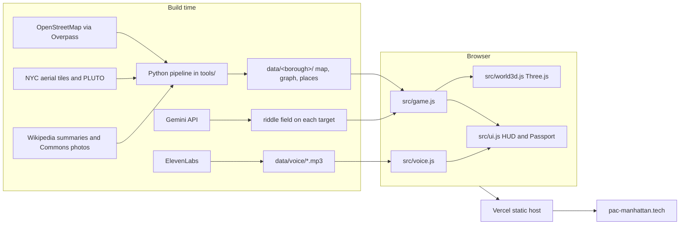
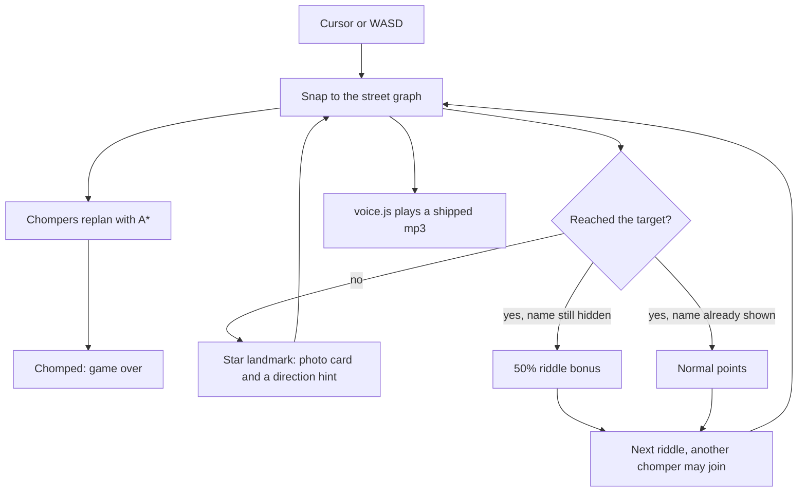

# Pac-Manhattan

You're the ghost. Hungry chompers hunt you through real New York streets in 3D while you race to find places and collect landmark stamps. Built at DivHacks 2026.

**Play:** https://pac-manhattan.tech (backup: https://pacmanhattan-kappa.vercel.app)

**The game is in [`upload-1-code/pacman-3d/`](upload-1-code/pacman-3d/).** Its [README](upload-1-code/pacman-3d/README.md) covers how to play, the code layout, and how to rebuild the map data. The Devpost draft is [`docs/devpost.md`](docs/devpost.md).

```sh
cd upload-1-code/pacman-3d
python3 -m http.server 8765
# open http://localhost:8765
```

- Five boroughs: Manhattan (the whole island), Brooklyn, Queens, the Bronx and Staten Island.
- **All five boroughs** on one map: bridges to Brooklyn, Queens and the Bronx, and the Staten Island Ferry (chompers can't board). There's also a smaller Manhattan + Brooklyn map.
- Real building colors: roofs from NYC's 2018 aerial photos, walls from NYC PLUTO year built and building class.
- 1 player, or 2 players split screen on one keyboard.
- Manhattan tasks are riddles. The name appears after 30 seconds, at a star landmark, or when you press R. Finding it before the name shows is a 50% bonus.

Map data © OpenStreetMap contributors (ODbL). Aerial imagery © NYC DoITT. Lot data: NYC PLUTO.

## Architecture

Keys are used once, while building. The site that players open is a static folder: JSON maps, mp3 lines, and plain JavaScript. Nothing in the browser calls Gemini or ElevenLabs.



One frame of a run:



| Piece | Where | What it does |
|---|---|---|
| Street graph and A* | `src/graph.js` | Movement and chaser plans stay on real streets |
| Game loop, tasks, two-player | `src/game.js` | Riddle timer, scoring, ferry, bridges, chomper personalities |
| 3D city | `src/world3d.js` | Buildings, gold target beam, see-through shader |
| HUD | `src/ui.js` | Task card, Passport, minimap, place cards |
| Narrator | `src/voice.js` | Plays ElevenLabs mp3s in `data/voice/` |
| Riddle writer | `tools/make_riddles.py` | Gemini, then a name-leak and number check |
| Narrator recorder | `tools/make_voice.py` | ElevenLabs, once, into mp3 files |
| Scores and Passports | `src/cloud.js`, `api/` | MongoDB Atlas. Needs `MONGODB_URI`. |
| Know-the-block and riddle stats | `src/tiger.js`, `api/block.js`, `api/events.js` | Tiger Data. Needs `TIGER_DATABASE_URL`. |
| Map builder | `tools/build_borough.py`, `tools/build_bridges.py` | OSM, coastline, bridges, ferry, building colors |

## Sponsors

The game plays without the databases. Scores fall back to the browser, and the Tiger panel stays hidden, until the two connection strings are set. Neither string is in the repo.

### In the build

**Know Your City (main track).** The board is the real city. Each task is a place you can walk to. The Passport is a stamp book of landmarks you reached. The five-borough map is the "know more than your own borough" pitch: bridges, the ferry, and places outside Midtown.

**Best Use of Gemini API.** `tools/make_riddles.py` calls `gemini-3.1-flash-lite` with `GEMINI_API_KEY`. For every target it sends that place's own fact and Wikipedia summary and asks for one sentence. A checker rejects the line if it contains a word from the place name, or a number that is not in the source, and retries up to three times. The kept line is stored as `riddle` on the place. The browser never sees the key. Places that fail the check show their name, same as before.

```sh
cd upload-1-code/pacman-3d
GEMINI_API_KEY=... python3 tools/make_riddles.py
python3 tools/build_bridges.py   # copy riddles onto the multi-borough maps
```

**Best Use of ElevenLabs.** This is the voice of the game. `tools/make_voice.py` calls Multilingual v2, voice Laura, with `ELEVENLABS_API_KEY`, and writes 16 mp3s into `data/voice/`: welcome, the riddle prompt, landmark, solved, found, a new chomper, "behind you", each bridge, the ferry, and game over. `src/voice.js` plays those files. There is no second narrator. The key is not in the site.

```sh
ELEVENLABS_API_KEY=... python3 tools/make_voice.py
```

**Best Use of MongoDB Atlas.** `api/scores.js`, `api/stamps.js`, and `api/runs.js` save high scores, landmark stamps, and each finished Passport. `src/cloud.js` sends them and keeps a copy in the browser, then retries if the save fails. The connection string is `MONGODB_URI` (optional database name `MONGODB_DB`, default `pacmanhattan`). It is read only on the server, in `api/_lib/db.js`. It is not set in this repo, so `/api/health` returns 503 until you add it in Vercel, or in `upload-1-code/pacman-3d/.env.local` for `npm run dev`. In Atlas, allow `0.0.0.0/0` so Vercel can connect.

**Best Use of Tiger Data.** Place cards can show a "know the block" panel: buildings within about 150 m, from a 767,563-building NYC table (`api/block.js`). Every riddle outcome is written to the `pm_events` hypertable (`api/events.js`), and `pm_riddle_hourly` is a real-time continuous aggregate of solve rate and time (`api/riddle.js`). The schema is `sql/tiger.sql`. The connection string is `TIGER_DATABASE_URL`, read only in `api/_lib/tiger.js`. It is not set in this repo, so the panel does not appear until you add it the same way as `MONGODB_URI`, then run `psql "$TIGER_DATABASE_URL" -f sql/tiger.sql`.

**Best .Tech Domain Name.** The public URL is https://pac-manhattan.tech. Vercel serves the game. The backup URL is https://pacmanhattan-kappa.vercel.app. The functions in `api/` run on that same project, which is where the two URIs have to be set.

**SpaceXAI (Cursor + Grok).** Grok writes the on-screen lesson, not the voice. After you reach one of eight places, the card adds "What you just learned." Three cards also show a picture generated in Cursor (`data/lessons/`). The prompt is `upload-1-code/pacman-3d/prompts/grok-lessons.md`. The Wikimedia photo stays. ElevenLabs is still the only voice, including on the ferry and the Brooklyn Bridge, where the lesson is a toast under the ElevenLabs line.

### Other prizes, and why this game does not use them

| Prize | Why it is not this project |
|---|---|
| Move Smarter, Live Better, Hack the City | One submission, one main track. This one is Know Your City. |
| Best Beginner Hack | Only if everyone on the team is a first-time hacker. |
| Most Popular Hack | A vote, not an API. |
| Capital One Nessie | No banking or finance feature. |
| Ripple / XRPL | No wallet, no on-chain payment, no agent moving money. |
| Photon / Spectrum | No iMessage agent. |
| DeepSpace | No DeepSpace SDK. The site is a static folder. |
| Solana | No chain transactions. |
| Backboard | No memory API. Riddles are baked into `places.json`. |
| DigitalOcean | Hosted on Vercel, not DigitalOcean. |
